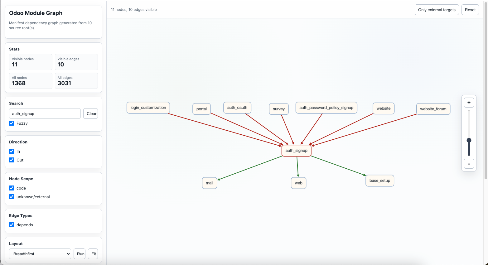

# OdooModuleMap

[English](README.md) | [中文](README.zh-CN.md)

[](https://www.python.org/)
[](results/graph.mmd)
[](#notes)


OdooModuleMap is a small tool for generating Odoo module dependency graphs.



It scans Odoo addon directories for `__manifest__.py` / `__openerp__.py`, parses manifest `depends`, and generates an interactive Cytoscape HTML graph, a Mermaid graph, and a summary report.

The current analysis scope only includes manifest `depends`. Python model inheritance, delegation inheritance, and XML view inheritance are not analyzed yet.

## Features

- Scan multiple Odoo addon source roots.
- Handle duplicate module names by using relative paths as node IDs while keeping module names visible in the UI.
- Generate an interactive HTML dependency graph.
- Support search, fuzzy search, incoming / outgoing edge filters, source filters, and layout switching.
- Generate `graph.json`, `graph.mmd`, and `summary.md` for review or further processing.
- No third-party Python package is required by default.

## Requirements

- Python 3.8+
- A browser

The Python scripts currently use only the standard library. `requirements.txt` is kept to make the dependency status explicit.

## Project Structure

```text
OdooModuleMap/
├── code/
│   ├── find_module_depends.py
│   └── render_graph_html.py
├── config/
│   └── source_roots.example.json
├── results/
│   ├── graph.json
│   ├── graph.mmd
│   ├── graph_cytoscape.html
│   └── summary.md
├── static/
│   └── js/
│       └── cytoscape.min.js
├── main.py
├── README.md
├── README.zh-CN.md
└── requirements.txt
```

## Quick Start

Put `OdooModuleMap` in the root directory of your Odoo project, then run this command from that project root:

```bash
python3 OdooModuleMap/main.py
```

You can also run it from inside the tool directory:

```bash
cd OdooModuleMap
python3 main.py
```

After generation, open this file directly in your browser:

```text
OdooModuleMap/results/graph_cytoscape.html
```

## Source Roots

By default, if `config/source_roots.json` does not exist, the tool scans every folder under the parent directory of `OdooModuleMap`, except `OdooModuleMap` itself.

To maintain source roots manually, copy the example config:

```bash
cp OdooModuleMap/config/source_roots.example.json OdooModuleMap/config/source_roots.json
```

Then edit `source_roots`:

```json
{
  "source_roots": {
    "code": "code",
    "data": "data",
    "third_component": "third_component"
  }
}
```

Configuration notes:

- Each `source_roots` key is used as a source category name in the graph page.
- Absolute paths are supported.
- Relative paths are resolved from the parent directory of `OdooModuleMap`.
- When `config/source_roots.json` exists, only directories declared in that file are scanned.

## Output

Output directory:

```text
OdooModuleMap/results
```

Generated files:

- `graph_cytoscape.html`: interactive dependency graph page.
- `graph.json`: structured graph data.
- `graph.mmd`: Mermaid graph.
- `summary.md`: summary of module counts, edge counts, and target source categories.

The graph page loads local Cytoscape.js from `OdooModuleMap/static/js/cytoscape.min.js`.

## Star History

[](https://www.star-history.com/?repos=yangtiancheng%2FOdooModuleMap&type=timeline&logscale=&legend=top-left)

## Contributors

<a href="https://github.com/yangtiancheng/OdooModuleMap/graphs/contributors">
  
</a>

## Graph Page Usage

- The page searches `base` by default to avoid rendering the full graph on first load.
- The default layout is `Breadthfirst`.
- `Search` suggestions use the `dir/moduleName` format, for example `base/base`.
- `Fuzzy` is enabled by default. Disable it for exact matching by module name, relative path, or `dir/moduleName`.
- `In` / `Out` under `Direction` are editable only when `Search` matches modules.
- `Node Scope` filters nodes by scan source.
- `Run` reruns the selected layout.
- `Fit` zooms the current visible graph into view.
- Double-click a node to write that module into `Search` and rerun the layout.
- Clicking a node highlights outgoing edges in green and incoming edges in red.

## Scripts

- `main.py`: runs the full generation flow.
- `code/find_module_depends.py`: scans Odoo modules, parses manifest `depends`, and generates graph data.
- `code/render_graph_html.py`: reads `graph.json` and renders `graph_cytoscape.html`.

## Notes

- Python `_inherit`, `_inherits`, and XML `inherit_id` are not parsed yet.
- Rerun the generation command after modules are added, removed, or manifest dependencies change.
- Dependencies not found in the scan scope are marked as `unknown/external`.
